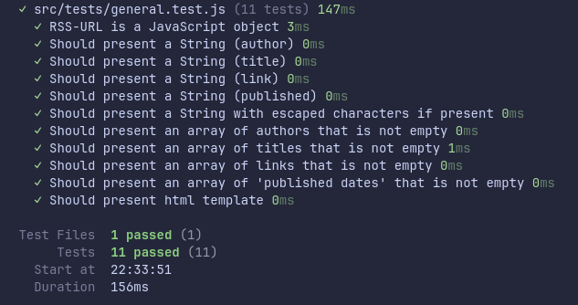
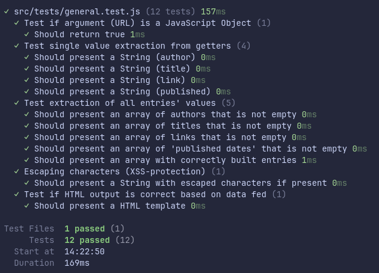

# Testrapport

## TLDR

Modulen har genomgått omfattande tester med olika _typer_ av data (Atom/RSS) och regelbunden, ständigt föränderlig, data från diverse RSS-flöden. _Alla_ edge cases är inte testade, men jag har i största möjliga mån parerat för felaktig data för att den slutgiltiga outputen ska vara presentabel för slutanvändaren.

## Testresultat #1

**Datum:** 2025-09-23

**Modulversion:** 0.1

**Testmiljö:**

- Visual Studio Code: 1.103.2
- Node.js: 22.17.0
- OS: Linux x64 6.8.0-79-generic
- Distribution: Linux Mint, Cinnamon 22.1

| Subjekt                | Hur det testats  | Testresultat |
| ---------------------- | :--------------: | :----------: |
| idk                    |       wut        |     wut      |
| hallo                  |       wut        |     wut      |
| **COVERAGE & SUCCESS** | 2 tests (2 FAIL) |   0 tests    |

### Detaljerade tester (stickprov)

| Vad som testats                                     | Förväntat resultat                   | Utfall  |
| --------------------------------------------------- | ------------------------------------ | ------- |
| Should present a String (title)                     | String med förväntat värde           | Success |
| Should present an array of titles that is not empty | Array med samtliga förväntade värden | Success |

##### Extraction of a single value within a feed

```javascript
it("Should present a String (title)", async () => {
  const title = await grabTitle(rssData.feed.entry[0]);
  expect(typeof title).toBe("string");
});
```

##### Extraction of multiple values within a feed

```javascript
it("Should present an array of titles that is not empty", async () => {
  const titlesArray = await grabAllTitles(rssData);
  expect(Array.isArray(titlesArray)).toBe(true);
  expect(titlesArray.length).toBeGreaterThan(0);
});
```

---

## 

### Kommentarer

Den första testsviten är väldigt rough around the edges.
Samtliga tester passerar vad gäller datahantering i ett första skede.
Nästa steg i testväg är att skapa en testsvit som kontrollerar datahantering (och HTML-output) efter refaktorering.

---

## Testresultat #2

**Datum:** 2025-09-24

**Modulversion:** 0.2

**Testmiljö:**

- Visual Studio Code: 1.104.1
- Node.js: 22.17.0
- OS: Linux x64 6.8.0-79-generic
- Distribution: Linux Mint, Cinnamon 22.1

##### Extracts all predetermined values of each entry within the feed provided (arg)

```javascript
  it("Should present an array with correctly built entries", async () => {
    const allEntriesFormattedInTest = await getAllEntries(rssData);
    console.log(allEntriesFormattedInTest);
    expect(Array.isArray(allEntriesFormattedInTest)).toBe(true);
    expect(allEntriesFormattedInTest.length).toBeGreaterThan(0);
  });
});
```

---

## 

### Kommentarer

Testsviten är nu strukturerad och mer överskådlig. Samtliga tester kan hantera RSS-data av typen Atom och har fallback ifall ett värde i ett entry saknas. Efter ytterligare refaktorering (där funktioner och ansvar fördelas mellan klasser) kommer testerna att vara mer omfattande, i mån av tid, såklart.

---

## Övrigt

Placeholder...
